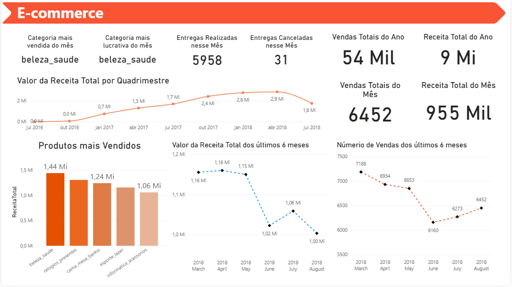

# e-commerce-data-warehouse-bi-dashboard

Projeto para portfólio focado na construção de um **Data Warehouse de Vendas (E-commerce)** utilizando **DuckDB** e arquitetura **Bronze / Silver / Gold**, com o objetivo de preparar dados confiáveis e reutilizáveis para análises e dashboards no **Power BI**.

---

## 📊 Dashboard (Power BI)

A camada **Gold** alimenta diretamente o Power BI com uma base pronta para BI.

---

## 🧱 Arquitetura de Dados - Medallion: Bronze / Silver / Gold

### Bronze 
- Ingestão dos arquivos **CSV** no formato original  
- Consulta via **DuckDB**
- Base para realizar análises exploratórias

### Silver 
- **Tratamento e padronização** 
- Dados prontos para modelagem e regras de negócio

### Gold
- Entrega de tabelas finais para consumo analítico
- **Modelagem dimensional em modelo estrela**
- Separação clara entre **fato** e **dimensões**, seguindo boas práticas de Data Engineering e Analytics

---

## 📌 Principais análises e KPIs
- **Receita total do mês / ano**
- **Vendas totais do mês / ano**
- **Top produtos e categorias** 
- **Categoria mais vendida e mais lucrativa**
- **Evolução temporal de receita** 
- **Entregas realizadas vs canceladas**

---

## 🛠️ Stack
- **Python e DuckDB** (DW local e SQL analítico)
- **Power BI** (modelagem, DAX e Dashboard)

---

## ✅ Objetivo do projeto
Construir uma base analítica confiável e escalável para e-commerce, seguindo uma arquitetura moderna de pipelines (**Medallion**) e entregando 4 datasets finais otimizados para BI (**star schema**), capaz de sustentar análises executivas e operacionais com consistência.

---
